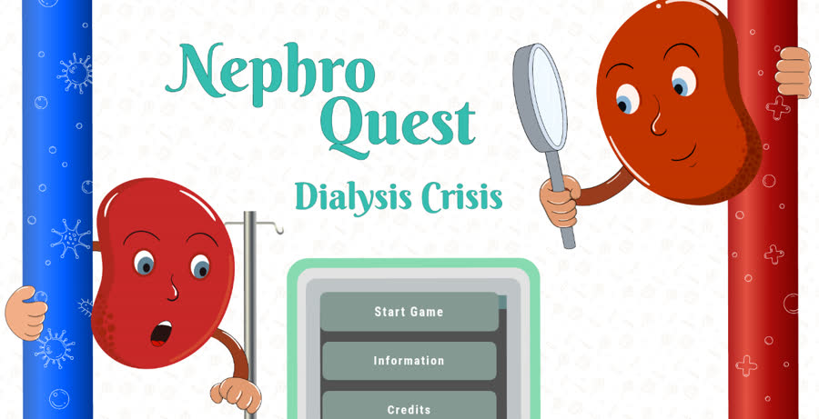
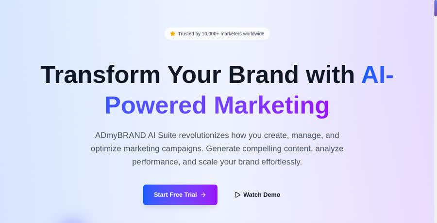

  

 

  
  &nbsp;
  
  &nbsp;
  
  &nbsp;
  

  

---

## new drop

  
  

  Private tasks + KhataBook money. Lock-screen alarms even when the app is closed. 
  Offline-first. No login. Made by Sandesh.

  
  

## toolkit

  

  
  
  
  
  
  

---

## live work

<table>
  <tr>
    <td align="center" width="50%">
      <a href="https://github.com/SandeshL702/sandeshdo">
        <h3>SandeshDo</h3>
      </a>
      
Tasks + paisa. Lock-screen alerts. <b>Remember · Do · Finish</b>

      
      
        
      <code>React</code> · <code>Android</code> · <code>offline-first</code>
    </td>
    <td align="center" width="50%">
      
      <h3>NephroQuest</h3>
      
Game for dialysis educators. <b>1k+ users · real payments</b>

      
        
      <code>PHP</code> · <code>MySQL</code> · <code>Razorpay</code>
    </td>
  </tr>
  <tr>
    <td align="center" width="50%">
      
      <h3>Ads dashboard</h3>
      
100k+ impressions. <b>Found where money leaked</b>

      
        
      <code>SQL</code> · <code>Tableau</code> · <code>Python</code>
    </td>
    <td align="center" width="50%">
      
      <h3>ADmyBRAND</h3>
      
SaaS landing that looks awake. <b>Next.js · motion · live</b>

      
      
        
      <code>Next.js</code> · <code>TypeScript</code> · <code>Tailwind</code>
    </td>
  </tr>
  <tr>
    <td align="center" width="50%">
      <h3>CareerSparks</h3>
      
Job board. <b>Apply with less friction</b>

      
        
      <code>Full-stack</code> · <code>MySQL</code>
    </td>
    <td align="center" width="50%">
      
      <h3>MyToken</h3>
      
Solidity mint/burn demo.

      <code>Solidity</code> · <code>Remix</code>
    </td>
  </tr>
</table>

---

## stamps

  
  
  

  
  
  

---

## pulse

  
  

  

---

  <b>say hi</b> — <a href="https://www.linkedin.com/in/sandesh-lanjewar">linkedin</a> · <a href="mailto:sandeshlanjewar702@gmail.com">mail</a>

